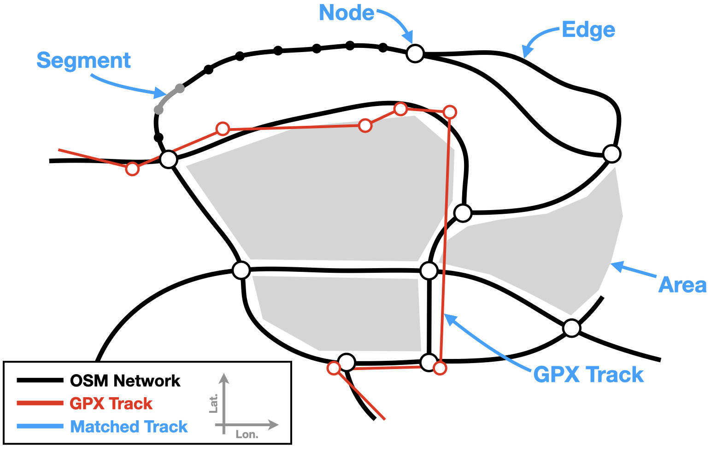

# Project description

## Long-distance hiking trails in Flanders
Grote Routepaden (abbreviated GR) is a Flemish nonprofit that manages long-distance hiking routes in Flanders (Belgium). Their website currently lists 28 such routes that range from 30 km to 500 km in length, which can be found [here](https://www.groteroutepaden.be/nl/wandelroutes) together with GPX coordinates for each route.

## GR Quality criteria
The organization has established several quality criteria to which the GR routes should conform. Details can be found (in Dutch) at [https://www.groteroutepaden.be/nl/wandelroutes/gr-wandelen/wandelkwaliteit-gegarandeerd](https://www.groteroutepaden.be/nl/wandelroutes/gr-wandelen/wandelkwaliteit-gegarandeerd) 

The summarized quality criteria are:
- At least 30% of a route should follow unpaved paths.
- At least 40% of a route should follow 'slow roads' without motorized traffic.
- A route should never follow roads with motorized traffic for more than 5 continuous km.
- At most 10% of a route should follow busy roads with major traffic.
- At most 20% of a route should pass through developed areas.
- At least two landscape types should be present in every 10 km (e.g. forests, fields, heath, ...)

## Project goals
Although these are well-established, the GR organization does not currently have a quantified overview of how precisely well their routes adhere to the above criteria. The organization has limited resources and mostly relies on volunteers to maintain and improve its trails. Within this context, **the goal of this project** is twofold:
- Algorithmically **evaluate the GR quality criteria** of all Flemish GR routes.
- **Present this data in a useful manner** that allows the organization to easily identify route sections that can be adjusted in order to meet/improve the quality criteria.

The detailed methodology of this project is discussed below. This project was developed in Python with the use of Jupyter notebooks and makes use of the following packages:

**Mapping and geometry packages**
- [osmnx](https://github.com/gboeing/osmnx)
- [shapely](https://github.com/shapely/shapely)

**Data analysis packages**
- [pandas](https://github.com/pandas-dev/pandas)
- [geopandas](https://github.com/geopandas/geopandas)
- [numpy](https://github.com/numpy/numpy)

**Data visualization packages**
- [matplotlib](https://github.com/matplotlib/matplotlib)
- [folium](https://github.com/python-visualization/folium)

# OSM Database
## Elements of the OSM database
The Open Street Maps (OSM) database provides access to free, open-source map data. A high-level description of the database elements can be found [here])https://wiki.openstreetmap.org/wiki/Elements) but, for the purposes of this project, we define the following terminology for OSM elements:

- **Node**: A point with latitude and longitude coordinates.
- **Edge**: A connection between two nodes, representing a road or path. An edge object contains a list of latitude/longitude points that define the geometry of the road; we refer to these as segments. Each edge has various associated properties that are useful for this project, such as highway, surface, and tracktype.
- **Area**: A region of surface defined by a series of latitude/longitude points, with various associated properties that are useful for this project, such as landuse and admin_level.

These elements are also illustrated below, together with a sample GPX track.

## Information required to quantify GR quality criteria
The six quality criteria listed on the above require knowledge of **three  properties** that can be assessed for each small section of a hiking route:

- **Paved** type: Is the section unpaved, semi-paved, or fully paved?
- **Traffic** type: Is the section closed to motorized traffic, open to motorized traffic, or intensively used by motorized traffic?
- **Development** type: Does the section traverse a developed area of not?

## Relevant OSM network properties
To establish the value of these three custom properties for each section of a hiking route, we extract four relevant standard properties (”keys”) from the OSM network:

- `Highway` key (defined for edges): Defines the type of road (e.g. freeway, main road, local road, trail), see [here](https://wiki.openstreetmap.org/wiki/Key:highway) for a list of all possible values.
- `Surface` key (defined for edges): Defines the surface of a road (e.g. asphalt, sand, grass), see [here](https://wiki.openstreetmap.org/wiki/Key:surface) for a list of all possible values. Note that this key is not defined for all roads but is often implied by the value of the highway key (e.g. a freeway will have an asphalted surface).
- `Tracktype` key (defined for edges): Defines the firmness of the road surface, see [here](https://wiki.openstreetmap.org/wiki/Key:tracktype) for a list of all possible values. This key is typically only defined for roads with the key highway=track. The tracktype can assume 5 values, with grade1 indicating a paved road and grade2 through grade5 indicating progressively rougher surfaces.
- `Landuse` key (defined for areas): Defines the land use of an area of land (e.g. industry, residential, forest), see [here](https://wiki.openstreetmap.org/wiki/Key:landuse) for a list of all possible values.