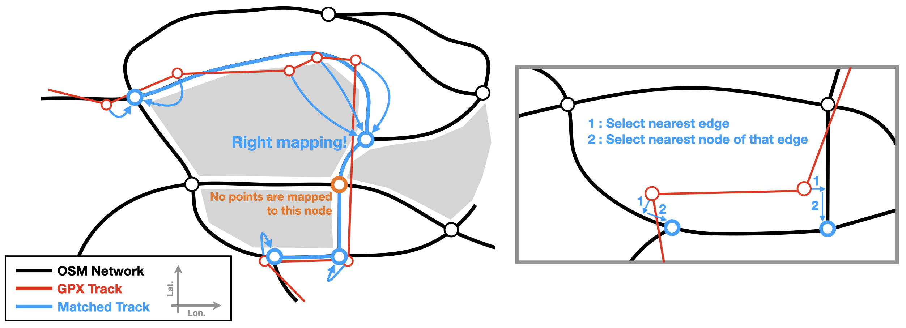
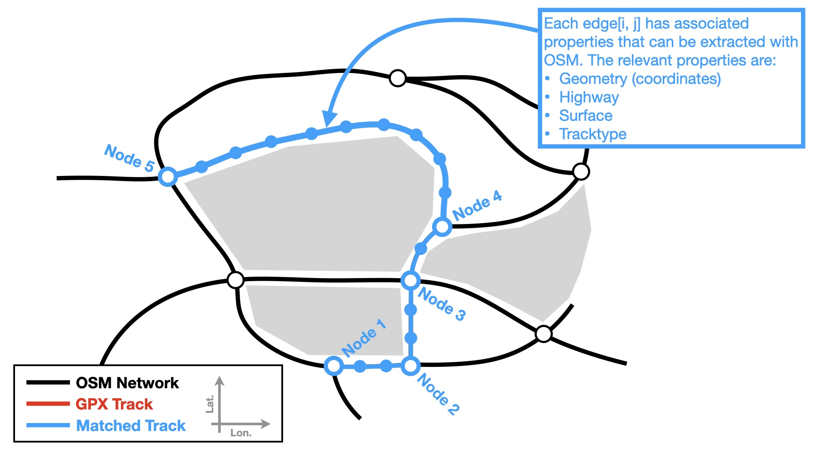
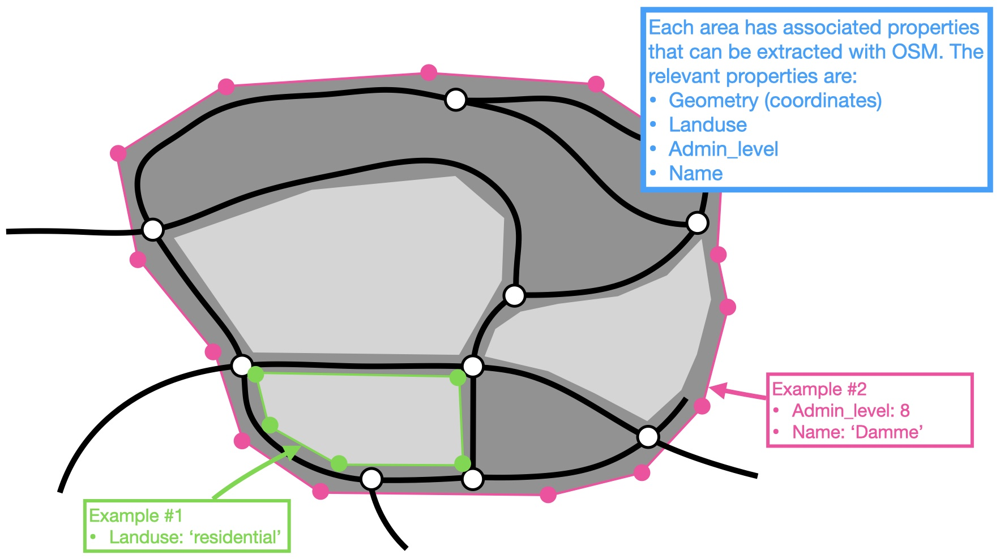

# Project description

## Long-distance hiking trails in Flanders
Grote Routepaden (abbreviated GR) is a Flemish nonprofit that manages long-distance hiking routes in Flanders (Belgium). Their website currently lists 28 such routes that range from 30 km to 500 km in length, which can be found [here](https://www.groteroutepaden.be/nl/wandelroutes) together with GPX coordinates for each route.

## GR Quality criteria
The organization has established several quality criteria to which the GR routes should conform. Details can be found (in Dutch) at [https://www.groteroutepaden.be/nl/wandelroutes/gr-wandelen/wandelkwaliteit-gegarandeerd](https://www.groteroutepaden.be/nl/wandelroutes/gr-wandelen/wandelkwaliteit-gegarandeerd) 

The summarized quality criteria are:
- At least 30% of a route should follow unpaved paths.
- At least 40% of a route should follow 'slow roads' without motorized traffic.
- A route should never follow roads with motorized traffic for more than 5 continuous km.
- At most 10% of a route should follow busy roads with major traffic.
- At most 20% of a route should pass through developed areas.
- At least two landscape types should be present in every 10 km (e.g. forests, fields, heath, ...)

## Project goals
Although these are well-established, the GR organization does not currently have a quantified overview of how precisely well their routes adhere to the above criteria. The organization has limited resources and mostly relies on volunteers to maintain and improve its trails. Within this context, **the goal of this project** is twofold:
- Algorithmically **evaluate the GR quality criteria** of all Flemish GR routes.
- **Present this data in a useful manner** that allows the organization to easily identify route sections that can be adjusted in order to meet/improve the quality criteria.

The detailed methodology of this project is discussed below. This project was developed in Python with the use of Jupyter notebooks and makes use of the following packages:

**Mapping and geometry packages**
- [osmnx](https://github.com/gboeing/osmnx)
- [shapely](https://github.com/shapely/shapely)

**Data analysis packages**
- [pandas](https://github.com/pandas-dev/pandas)
- [geopandas](https://github.com/geopandas/geopandas)
- [numpy](https://github.com/numpy/numpy)

**Data visualization packages**
- [matplotlib](https://github.com/matplotlib/matplotlib)
- [folium](https://github.com/python-visualization/folium)

# OSM Database
## Elements of the OSM database
The Open Street Maps (OSM) database provides access to free, open-source map data. A high-level description of the database elements can be found [here])https://wiki.openstreetmap.org/wiki/Elements) but, for the purposes of this project, we define the following terminology for OSM elements:

- **Node**: A point with latitude and longitude coordinates.
- **Edge**: A connection between two nodes, representing a road or path. An edge object contains a list of latitude/longitude points that define the geometry of the road; we refer to these as segments. Each edge has various associated properties that are useful for this project, such as highway, surface, and tracktype.
- **Area**: A region of surface defined by a series of latitude/longitude points, with various associated properties that are useful for this project, such as landuse and admin_level.

These elements are also illustrated below, together with a sample GPX track.

## Information required to quantify GR quality criteria
The six quality criteria listed on the above require knowledge of **three  properties** that can be assessed for each small section of a hiking route:

- **Paved** type: Is the section unpaved, semi-paved, or fully paved?
- **Traffic** type: Is the section closed to motorized traffic, open to motorized traffic, or intensively used by motorized traffic?
- **Development** type: Does the section traverse a developed area of not?

## Relevant OSM network properties
To establish the value of these three custom properties for each section of a hiking route, we extract four relevant standard properties (”keys”) from the OSM network:

- `Highway` key (defined for edges): Defines the type of road (e.g. freeway, main road, local road, trail), see [here](https://wiki.openstreetmap.org/wiki/Key:highway) for a list of all possible values.
- `Surface` key (defined for edges): Defines the surface of a road (e.g. asphalt, sand, grass), see [here](https://wiki.openstreetmap.org/wiki/Key:surface) for a list of all possible values. Note that this key is not defined for all roads but is often implied by the value of the highway key (e.g. a freeway will have an asphalted surface).
- `Tracktype` key (defined for edges): Defines the firmness of the road surface, see [here](https://wiki.openstreetmap.org/wiki/Key:tracktype) for a list of all possible values. This key is typically only defined for roads with the key highway=track. The tracktype can assume 5 values, with grade1 indicating a paved road and grade2 through grade5 indicating progressively rougher surfaces.
- `Landuse` key (defined for areas): Defines the land use of an area of land (e.g. industry, residential, forest), see [here](https://wiki.openstreetmap.org/wiki/Key:landuse) for a list of all possible values.

In addition, we would like to collect the name of cities and towns alongside a hiking route, to help with data visualization. To do this, we extract the following additional two properties:

- `Admin_level` key (defined for areas): Defines the administrative level (e.g. province, city, town) of an area, see [here](https://wiki.openstreetmap.org/wiki/Key:admin_level) for a list of all possible values.
- `Name` key (defined for areas): The name corresponding to the `admin_level` that is defined for an area.

## Mapping OSM properties to GR properties
In order to determine the whether a hiking route satisfies the GR quality criteria, it is necessary to establish a mapping from the four relevant OSM keys (`highway`/`surface`/`tracktype`/`landuse`) to the three GR properties (`paved`/`traffic`/`development`). It was necessary to decide this mapping together with the GR organization, as it is somewhat arbitrary which surface types are considered unpaved/semi-paved/paved. The mappings are defined below.

### Traffic type
Three possible traffic types are defined:

- Slow road: Any road where motorized traffic is not allowed.
- Busy road: Major roads with significant traffic, where hikers may have to walk on the shoulder for safety reasons.
- Normal road: All other roads.

The table below maps the possible values of the `highway` key in OSM to the corresponding GR classification.

table here

### Development type
Two possible development types are defined:

- Heavy development: City centers, residential areas, industrial areas, and all other areas where a hikers feels that they are “walking among houses.”
- Light development: All other areas with little or no houses or other activity.

The table below maps the possible values of the `landuse` key in OSM to the corresponding GR classification.

table here

### Paved type
Three possible paved types are defined:

- Unpaved: Permeable surface without artificial reinforcement (e.g. dirt, grass, sand).
- Semi-paved: Permeable surface with reinforcement (gravel, pebbles, wood).
- Paved: Impermeable surface (asphalt, concrete, paving stones)

To establish the paved type of a section, it is necessary to simultaneously examine the values of the `highway`, `surface`, and `tracktype` keys. This is because not all roads accessible to motorized traffic are necessarily paved, and not all hiking trails are necessarily unpaved. The following schema is used to determine the paved type (note that the `highway` key is always provided, the `surface` key is sometimes provided, and the `tracktype` key is rarely provided):

### Conclusion
The OSM network provides the information necessary to evaluate the paved/traffic/development type of each section of a hiking route. In turn, these three properties can be used to calculate to which extent a route complies with the quality criteria defined by the GR organization. The table below summarizes which OSM properties map to which GR property.

table here

However, it remains necessary to perform some advanced processing of the OSM network and the coordinates of a hiking route. This is because a hiking route is defined as a collection of GPX points with latitude/longitude/elevation information that inherently differs slightly from the underlying road network. This is because a GPS measurement always contains some degree of error, as illustrated below.

This is why it is not straightforward to determine precisely which set of OSM edges should be covered by a route. The process used to perform this determination is described below. Similarly, the process used to collect relevant area information is described.

# Road matching
This page describes how a hiking route may be converted into a sequence of traversed OSM edges with their corresponding `highway`, `surface`, and `tracktype` properties. It is tempting to simply match each (latitude, longitude) point of a GPX track to the nearest OSM node, which could be done using the [nearest_nodes](https://github.com/gboeing/osmnx/blob/fb4dfb394c13e8ba33324c11ba91c4b589d412a2/osmnx/distance.py#L162) function of the OSMnx package. However, this method is flawed due to the position errors and potential sparsity of the GPX track. This is illustrated in the figure below, where three GPX points are mapped to the wrong OSM node. This results in the blue 'matched track' that clearly does not match the actual path that the GPX track follows.

Instead, we use the following approach. For each GPX point, we determine the nearest edge from the OSM network, using the [nearest_edges](https://github.com/gboeing/osmnx/blob/fb4dfb394c13e8ba33324c11ba91c4b589d412a2/osmnx/distance.py#L237) function from the OSMnx package. Then, we take the two end nodes of that edge, and calculate which of the two our GPX point is closest to. This node is then added to the list of traversed nodes. This process is illustrated below.

Note that, even with this approach, it is still possible for some nodes not to be included in the list of traversed nodes. This may happen when the GPX track is sparsely populated, as illustrated by the orange node in the figure above. We correct for this by looping through the list of traversed nodes and calculating the shortest path between each successive node pair, using the [shortest_path](https://github.com/gboeing/osmnx/blob/fb4dfb394c13e8ba33324c11ba91c4b589d412a2/osmnx/distance.py#L379) function from the OSMnx package. This results in a final list of nodes that are successively connected with edges.

For each of these edges, we extract the underlying geometry (points with latitude/longitude coordinates) as well as the `highway`, `surface`, and `tracktype` properties, as illustrated below. This allows us to finally extract a list of OSM segments with associated properties that compose a hiking route defined by a series of GPX points. These properties can be processed into the required GR properties by following the rules described above.

Next, we must also extract information about the areas surrounding the hiking route. This process is detailed below.

# Place matching
Extracting the relevant area properties is straightforward. Using OSMnx, we query the OSM database for all areas that have a `landuse` or `admin_level` key, in the immediate neighborhood of the considered hiking route. Using the resulting list of areas, two properties are calculated:

- Dev_dist (distance to the nearest developed area): For each segment of the hiking route, we calculate the minimum distance to any area with a `landuse` value that indicates heavy development, as defined above. This calculation is performed using the `distance` function from the Shapely package. This distance value allows us to classify a route segment as having heavy development if it lies within e.g. 25 meters from the nearest  area with a corresponding `landuse` value.
- City: For each segment of the hiking route, we calculate which area with an admin_level of 8 ('gemeente') or 9 ('deelgemeente') that segment lies within. This calculation is performed using the `within` function from the Shapely package. The corresponding town/city name is collected and stored, and can be useful when plotting the hiking route data.

This process is also illustrated below.

